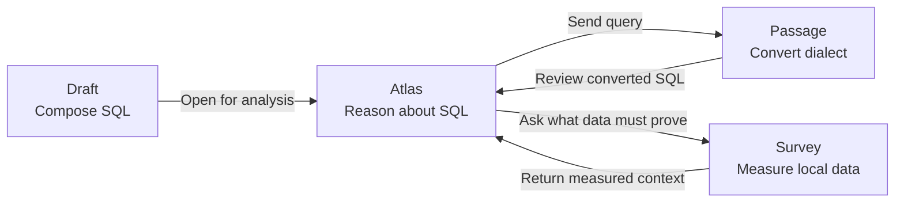
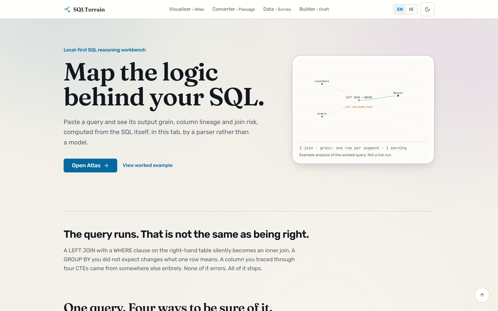
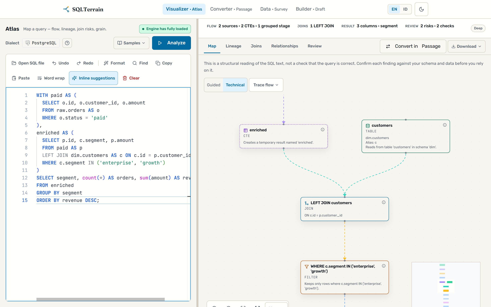
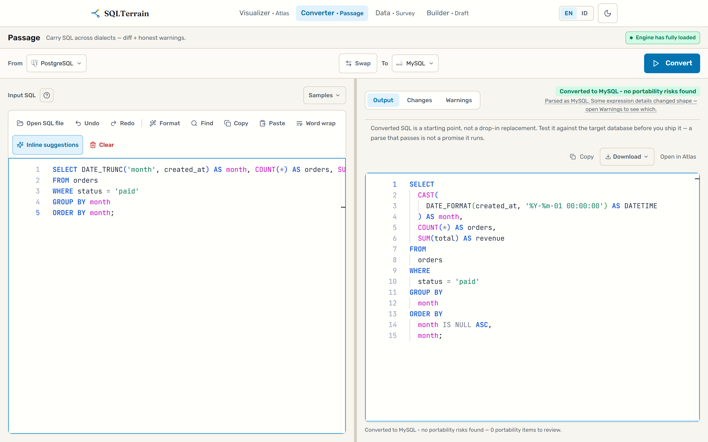
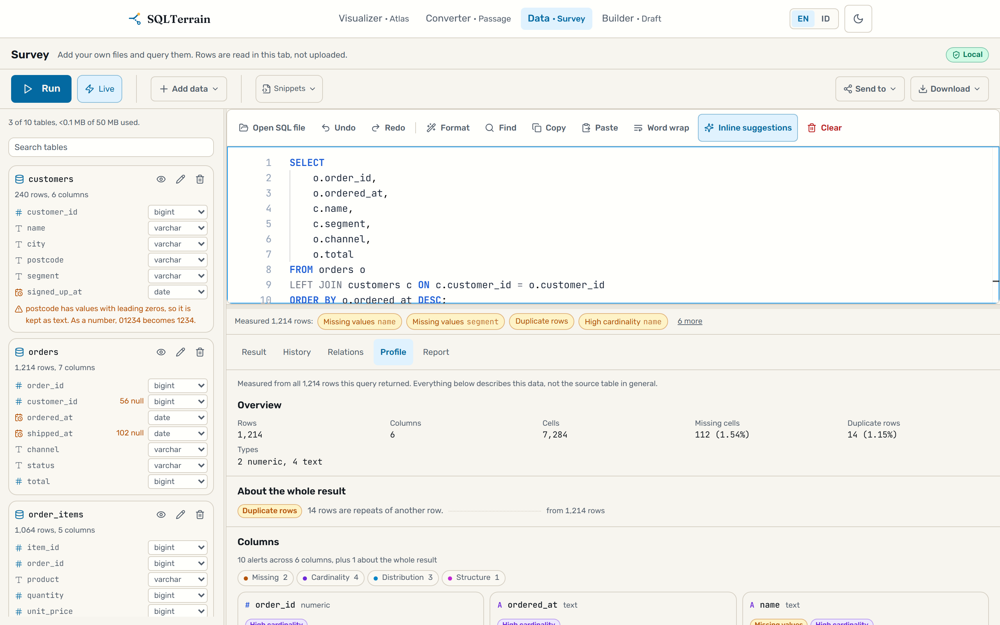
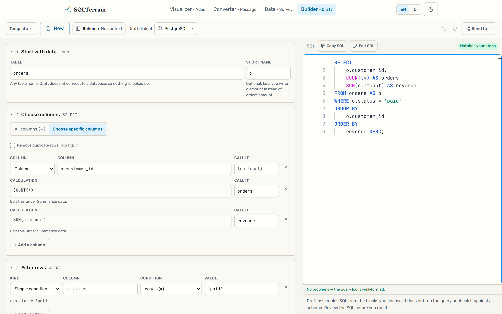
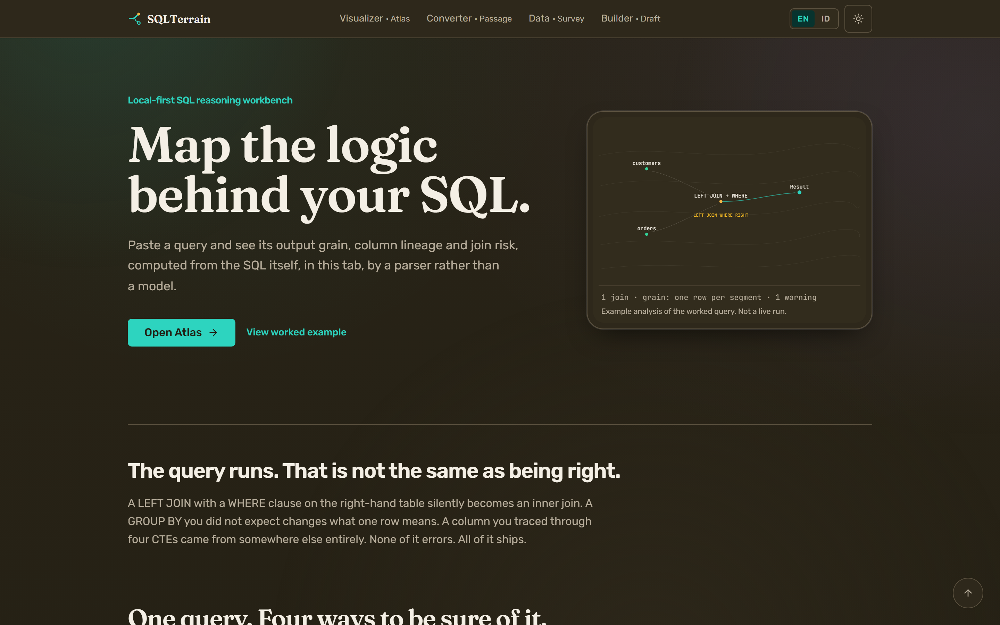
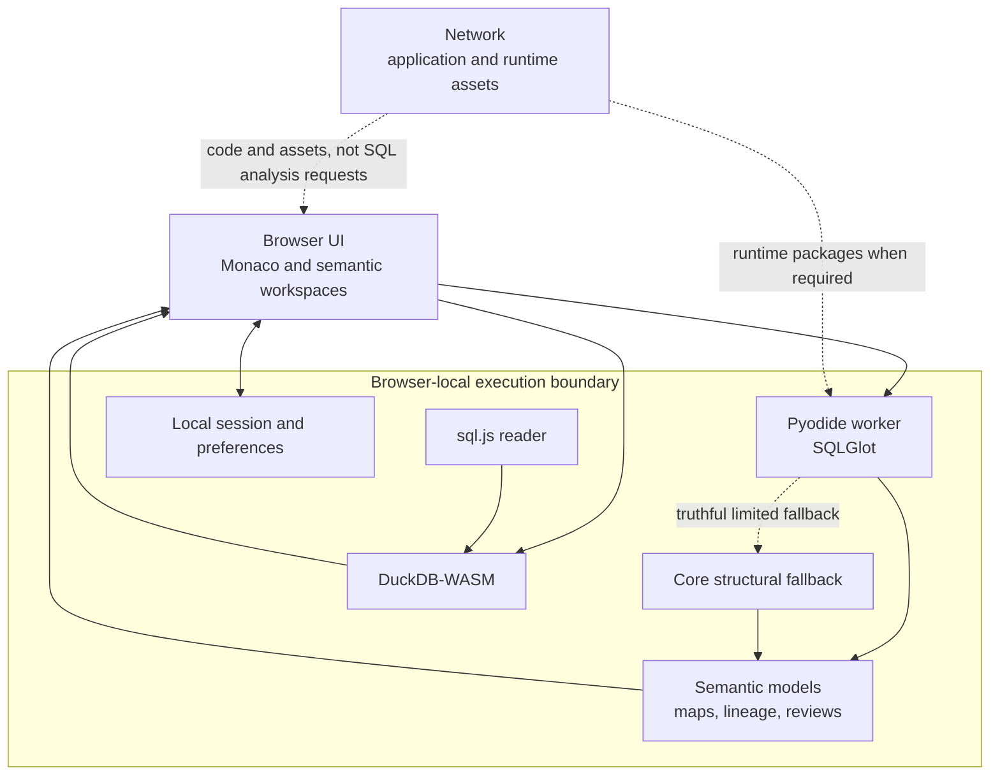

# SQLTerrain

**Map the logic behind your SQL.**

SQLTerrain is a local-first SQL reasoning workbench for people who need to understand what a query does before they trust it. It helps trace where data comes from, where rows can disappear or multiply, what grain a result represents, what changed during dialect conversion, and which assumptions still require evidence from real data.

[Try SQLTerrain](https://sqlterrain.caesarmar.io/en)

> This repository is a public product and engineering showcase. The application source is maintained privately.

## The problem

SQL is compact, but its consequences often are not. A query can be syntactically valid while still hiding a changed grain, a null-rejecting filter after an outer join, a many-to-many expansion, a dialect-specific rewrite, or an assumption that only the underlying rows can prove.

Most teams investigate these questions by reading SQL manually, running fragments in a database, and writing one-off profiling queries. Those steps are necessary, but the reasoning is fragmented. SQLTerrain puts four related workflows in one browser-based product:

- **Visualizer · Atlas** explains the structure and flow of a query.
- **Converter · Passage** translates SQL while showing what changed and what still needs review.
- **Data · Survey** measures facts in local data that SQL text alone cannot establish.
- **Builder · Draft** helps compose structured SQL while keeping the generated query visible and editable.

The shared idea is simple: separate what can be proven from SQL, what can be measured from data, and what remains uncertain.

## Four tools, one reasoning workflow

| Tool | Question it answers | Primary evidence |
|---|---|---|
| [Visualizer · Atlas](https://sqlterrain.caesarmar.io/en/visualizer) | How does this query transform rows and columns? | Parsed scopes, dependencies, joins, lineage, grain, review findings |
| [Converter · Passage](https://sqlterrain.caesarmar.io/en/converter) | How can this SQL move to another dialect, and what changed? | Target SQL, structured diff, portability findings, conversion provenance |
| [Data · Survey](https://sqlterrain.caesarmar.io/en/survey) | What is actually true in these files or local tables? | Browser-local queries, profiles, distributions, missingness, relationships |
| [Builder · Draft](https://sqlterrain.caesarmar.io/en/builder) | How can I assemble a query without losing sight of the SQL? | Semantic blocks, generated SQL, editable text, synchronization status |

This is not a forced wizard. Each tool works independently. The handoffs exist so that a query does not have to be copied through disconnected utilities when the next question becomes obvious.

## Product evidence

The screenshots below were captured on 22 September 2026 from the exact SQLTerrain `0.149.0` main baseline at a 1440×900 CSS viewport and 2× pixel density. Stateful examples use public synthetic queries and datasets; no production SQL, customer data, or internal debug state is shown.

### Overview

The homepage presents the product as a reasoning workflow rather than a collection of unrelated SQL utilities.

### Visualizer · Atlas

Atlas turns SQL structure into an explorable map, then connects the map to lineage, join behavior, execution stages, and review evidence. It does not infer production keys, uniqueness, or cardinality from convenient column names. When the query cannot prove a fact, Atlas leaves it unresolved or routes the question to verification.

### Converter · Passage

Passage treats conversion as an evidence problem, not a text replacement problem. The target query is paired with a structured account of material changes, review-required constructs, and the engine path that produced the result.

### Data · Survey

Survey closes the gap between static reasoning and data facts. It runs analytical queries and profiling in the browser, so questions such as uniqueness, missingness, skew, duplicates, and relationship evidence can be measured without sending the dataset to an analysis service.

### Builder · Draft

Draft uses guided semantic blocks while keeping SQL visible. The visual model represents a bounded structured subset; unsupported SQL stays as SQL instead of being coerced into a misleading partial block document.

### Warm dark mode

The light interface is the primary product presentation. A warm dark system remains available across the same workflows without changing their information hierarchy.

## Architecture at a glance

SQLTerrain is a browser application built around deterministic engines rather than a server-side analysis API.

The deeper parser and converter run through SQLGlot inside a Pyodide worker. Atlas and Passage validate engine boundaries before accepting results, preserve editor input across recoverable failures, and keep the actual producer attached to each result. Survey uses DuckDB-WASM for analytical execution and a browser-local SQLite reader before importing tables into the same analytical path. React Flow renders explorable semantic views; Monaco provides a real SQL editing surface.

Read the full [architecture notes](docs/ARCHITECTURE.md).

## Local-first, with an explicit network boundary

Core SQL reasoning happens in the browser. SQL text is not sent to a first-party or third-party analysis API. Survey processes imported data locally through browser-native engines.

Local-first does not mean that every byte is available offline. The application itself, browser runtime assets, and some WebAssembly or Python runtime packages may require network access. The deployed site may also use operational delivery services and an optional, bounded analytics endpoint. Product analytics are designed to exclude SQL and obvious personally identifying fields, honor Do Not Track, and remain disabled unless configured.

The detailed boundary is documented in [Privacy](docs/PRIVACY.md).

## Quality is treated as evidence

A parser returning a tree does not prove that a lineage edge is correct. A converted query parsing in the target dialect does not prove equivalent behavior. SQLTerrain therefore tests different claims at different layers:

- pure semantic contracts and invariants;
- real SQLGlot/Pyodide and DuckDB-WASM execution;
- independently authored oracles and negative controls;
- browser workflows, keyboard behavior, accessibility, and responsive layouts;
- cross-surface consistency between the UI and generated artifacts;
- explicit known-gap and unsupported states.

For SQLTerrain `0.149.0`, the Passage translation corpus was rerun on 22 September 2026 through the real SQLGlot/Pyodide path. It contained 238 hand-authored cases across 20 ordered routes among PostgreSQL, MySQL, SQLite, BigQuery, and Snowflake. The run produced 237 matched cases, one documented SQLite exact-decimal gap, zero undocumented mismatches, and zero cases without output. That is evidence about this corpus, not a claim of universal conversion accuracy.

Atlas is deliberately presented without a headline accuracy percentage here. Its public evidence is scoped to semantic contracts, real-engine regression suites, negative controls, and artifact consistency. Static analysis has hard epistemic limits, and broader adversarial certification should not be collapsed into a marketing badge.

See [Quality & Validation](docs/QUALITY_AND_VALIDATION.md) for the evidence model and its limitations.

## What makes the engineering interesting

The difficult part of SQLTerrain is not drawing boxes around clauses. It is maintaining a consistent fact model across several surfaces while refusing to make unsupported claims.

- **Grain is explicit.** Aggregation, joins, set operations, and windows can change what one output row represents.
- **Lineage is evidence-aware.** Direct references, expressions, aggregates, and unresolved paths are not treated as the same relationship.
- **Join reasoning distinguishes proof from assumptions.** SQL can prove row-preservation rules but usually cannot prove uniqueness or cardinality without schema or data evidence.
- **Conversion carries provenance.** Passage distinguishes produced SQL from checked, review-required, blocked, and known-gap states.
- **Survey measures the missing facts.** It can test uniqueness, nullability, distributions, and relationships against the rows that are actually available.
- **Failure preserves work.** Worker, parser, import, and rendering failures are designed not to replace the user's current SQL with a sample or stale result.
- **Unknown remains unknown.** The product prefers a visible limitation over a confident but fabricated answer.

## Boundaries

SQLTerrain is not a query optimizer, production database gateway, or substitute for execution plans and domain review.

- Static SQL cannot prove real row counts, key constraints, data distributions, or runtime cost.
- Dialect conversion is not guaranteed lossless. Some constructs have no faithful target equivalent.
- BigQuery and Snowflake paths are experimental rather than corpus-deep in the same way as the primary dialects.
- Browser-local computation has memory, CPU, runtime-startup, and browser-compatibility limits.
- Draft intentionally represents a bounded structured subset of SQL.
- The deterministic core is less open-ended than natural-language generation by design.

Read [Trade-offs & Boundaries](docs/TRADE_OFFS.md) for the reasoning behind these choices.

## Documentation

- [Architecture](docs/ARCHITECTURE.md)
- [Quality & Validation](docs/QUALITY_AND_VALIDATION.md)
- [Privacy](docs/PRIVACY.md)
- [Trade-offs & Boundaries](docs/TRADE_OFFS.md)

## Author

Built and maintained by [Mario Caesar](https://caesarmar.io).

### About this repository

This repository contains public product documentation and screenshots for SQLTerrain. The application source is maintained privately. It is not an installable distribution and does not accept source-code contributions.