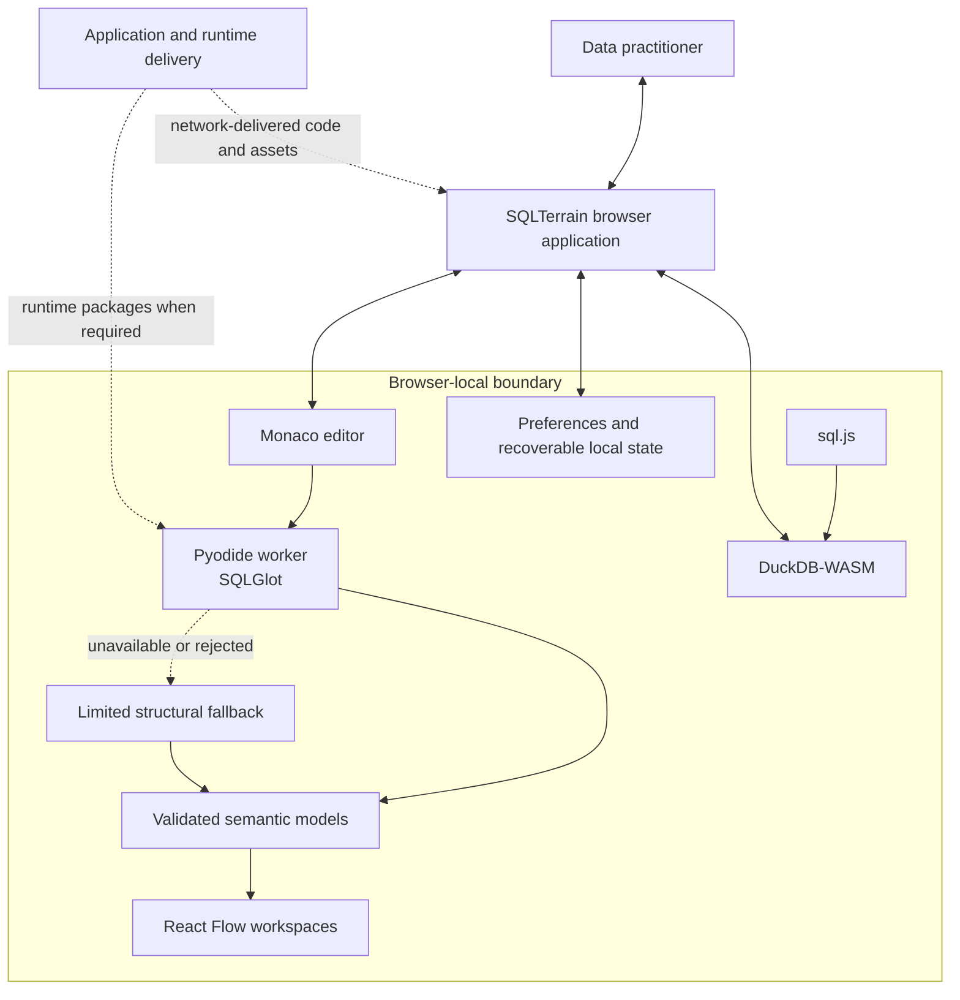
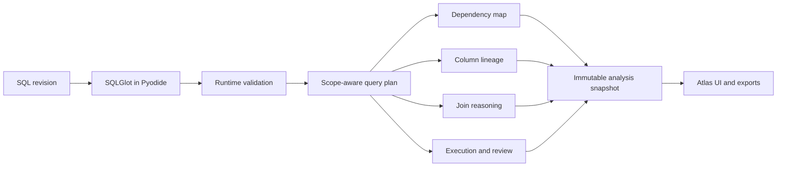
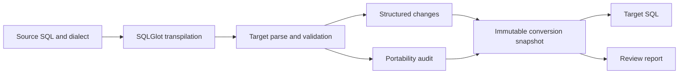
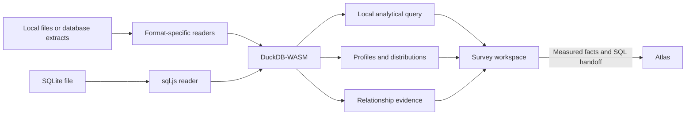
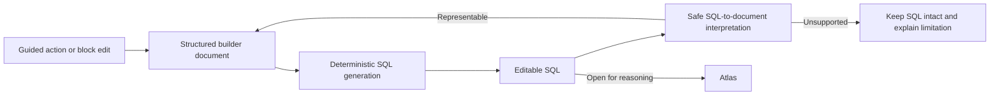

# Architecture

SQLTerrain is a local-first SQL reasoning workbench. Its architecture is organized around a strict boundary: user SQL and imported data are processed by engines running in the browser rather than sent to an application analysis API.

That decision shapes more than privacy. It affects startup time, failure handling, provenance, testing, state synchronization, and the kinds of claims the product can make honestly.

## Design goals

The architecture is built to preserve five properties:

1. **Deterministic reasoning.** The same supported input and engine version should produce the same semantic result.
2. **Local SQL and data processing.** Core analysis, conversion, profiling, and visual composition stay inside the browser process.
3. **Truthful provenance.** Every accepted result records the path that actually produced it. A ready deep engine cannot retroactively relabel a limited fallback result.
4. **Input safety.** Runtime, worker, parser, and rendering failures should not destroy the SQL or data-selection state the user was working with.
5. **Shared facts across surfaces.** Visual maps, reviews, reports, and cross-tool handoffs should derive from validated semantic models rather than reinterpreting the SQL independently.

## System boundary

The dotted network edges are intentional. SQLTerrain is local-first, not offline-only. Loading the application and initializing browser runtimes may require network access. The core distinction is that SQL text is not posted to an analysis service and Survey data is not uploaded to a profiling backend.

## The shared editing surface

Atlas, Passage, Survey, and Draft use Monaco as the SQL editing foundation. This provides syntax-aware editing, keyboard behavior, selection state, and a consistent command vocabulary across tools.

The editor value remains the user's source of work. Analysis results are versioned snapshots derived from that value. When the input revision changes, an older asynchronous worker response must not overwrite the newer query or pretend to describe it. This stale-result rule is load-bearing because browser workers and WebAssembly startup do not complete at deterministic wall-clock times.

## Atlas data flow

Atlas turns PostgreSQL into a semantic reasoning model.

The plan separates query scopes, source occurrences, joins, projections, filters, grouping, windows, set operations, and dependencies. This is necessary because a flat list of tables and clauses cannot represent repeated reads, nested scopes, or branch-specific behavior accurately.

Atlas distinguishes structural facts from evidence that SQL cannot provide. A `LEFT JOIN` proves which side is preserved by the operator, but the query alone usually cannot prove that the join key is unique or that a many-to-many expansion will occur on a particular dataset. Those questions become verification items rather than invented conclusions.

When the deeper engine cannot produce an accepted plan, Atlas may present limited structural analysis. That state is labelled by capability, not by a library name, and its provenance remains attached to the result. The interface must not combine a valid deep plan with a weaker flat interpretation merely to fill a panel.

## Passage data flow

Passage treats conversion as a pipeline with evidence:

The target SQL is only one output. The snapshot also records dialects, conversion provenance, structured differences, warnings, and whether the result is checked, requires review, or is blocked.

This matters because target SQL can parse while still changing behavior. Type systems, date functions, null ordering, upsert syntax, JSON operators, and identifier rules vary across dialects. Passage therefore avoids the word “lossless” and publishes known gaps rather than hiding them behind a successful parse.

The primary corpus covers PostgreSQL, MySQL, SQLite, BigQuery, and Snowflake. SawitDB uses a separate normalization path and must not inherit claims from the 20-route mainstream-dialect corpus.

## Survey data flow

Survey exists because static SQL analysis cannot settle facts that live in the rows.

DuckDB-WASM provides the analytical runtime. CSV and other supported inputs enter format-specific readers; SQLite is decoded locally through `sql.js` and then enters the same DuckDB analytical path. The product can calculate row counts, missingness, distinctness, distributions, correlations, and relationship evidence without a server database connection.

Profiling results retain their scope. A result calculated over a sample must not be presented as though every row was measured. A relationship suggestion is evidence to inspect, not an automatically declared primary or foreign key.

Survey can hand measured context to Atlas. This closes a useful loop: Atlas identifies an assumption the query cannot prove, Survey measures available data, and Atlas can show the added evidence until the SQL changes and invalidates it.

## Draft data flow

Draft combines a semantic document model with generated SQL:

Blocks encode query structure rather than acting as decorative cards. The document supports deterministic operations, undoable transactions, generated SQL, and guided templates. Reverse synchronization is deliberately conservative. If edited SQL cannot be represented safely, Draft preserves the text instead of constructing a partial document that changes its meaning.

## Cross-tool handoffs

Handoffs transfer user intent, not hidden engine state.

- Draft can open generated or edited SQL in Atlas.
- Atlas can send the current query to Passage for dialect conversion.
- Passage can return converted SQL for another analysis pass.
- Survey can send a query or measured context to Atlas.

The receiving tool validates the handoff and keeps the transferred SQL editable. Handoff state is bounded and recoverable; it is not a cloud document system.

## Reliability strategy

### Versioned boundaries

Worker messages and complex semantic models are checked at runtime. Zod schemas prevent a malformed or outdated payload from silently reaching graph and report code. Protocol migrations are explicit because a visual that partially understands a newer plan can be more dangerous than a visible refusal.

### Immutable result snapshots

An analysis or conversion result represents one input revision. UI panels and exports should read the same accepted snapshot. Re-parsing independently inside a report or diagram renderer would create multiple fact sources and make disagreement inevitable.

### Stale-response protection

Requests carry input revisions. A late worker response is discarded if the editor has moved on. During a temporarily invalid edit, the product may keep the last valid result visible as stale or updating, but must not present cross-selection as if it describes the current SQL.

### Failure containment

Chunk loading, worker startup, Pyodide initialization, parsing, file reading, clipboard access, and rendering can all fail. Recoverable errors preserve the user's current input, explain which capability failed, and offer a safe retry or fallback. A retry acts on the current value rather than restoring a sample.

### Truthful fallback

The browser-local deep engine is preferred for dialect-aware analysis. A limited Core path exists so that a runtime-loading failure does not necessarily make the editor unusable. The accepted result records which capability actually produced it. Fallback is never silent, and deeper-engine readiness after the fact does not upgrade an older result's provenance.

## Network and deployment boundary

The deployed application is static and browser-oriented. Network activity can include:

- application HTML, JavaScript, fonts, images, and sample assets;
- Pyodide and required runtime packages;
- operational hosting or CDN requests;
- an optional configured analytics endpoint carrying bounded event metadata.

SQL text and imported Survey data are outside the analytics contract. Analytics is disabled unless configured, honors Do Not Track, and sanitizes properties by rejecting query-like and personally identifying keys and oversized strings. Hosting infrastructure may still collect ordinary delivery logs outside the application analytics module.

## Technology choices

| Technology | Architectural role |
|---|---|
| Next.js 14, React 18, TypeScript | Static product shell and typed UI |
| Monaco | SQL editing and source interaction |
| SQLGlot | Dialect-aware parsing and transpilation |
| Pyodide | Browser runtime for SQLGlot |
| DuckDB-WASM | Browser-local analytical execution |
| sql.js | Browser-local SQLite ingestion |
| React Flow | Explorable dependency and lineage views |
| Zod | Runtime validation at engine boundaries |
| Vitest and Playwright | Semantic, real-engine, component, and browser validation |

These choices are not an infrastructure logo wall. Each exists because it supports a specific product boundary. No backend, queue, orchestration system, or production database is depicted because the current product does not use one for its core workflow.

## What the architecture does not claim

- It does not provide production query plans or cost estimates.
- It does not connect to a production database for Atlas or Passage.
- It does not prove schema constraints that were not supplied or measured.
- It does not guarantee that every browser can process arbitrarily large files.
- It does not guarantee semantic equivalence for every dialect conversion.
- It does not use an LLM in the core reasoning path.

Those limits are part of the design, not footnotes to hide. See [Trade-offs & Boundaries](TRADE_OFFS.md) for the decisions behind them.
