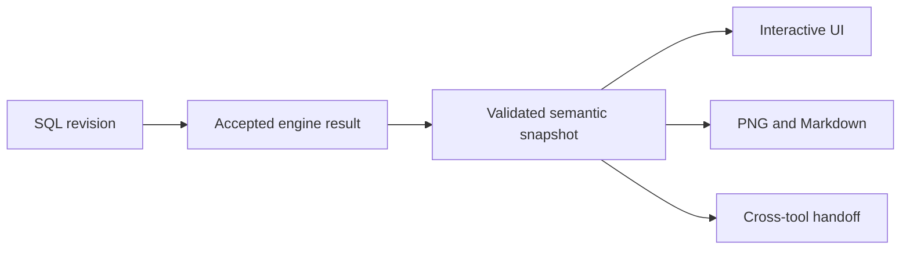

# Quality & Validation

## Quality is evidence, not a test-count badge

A query parsing successfully does not prove that the analysis is truthful. A converted query parsing in the target dialect does not prove equivalent behavior. A profiling screen rendering does not prove that its row counts or correlations are correct.

SQLTerrain therefore validates claims at the layer where they can fail. The public evidence in this document is a bounded snapshot for SQLTerrain `0.149.0`, rechecked on 22 September 2026. It is not a universal accuracy guarantee and it should not be carried forward to a later version without rerunning the relevant evidence.

## Validation layers

### 1. Pure semantic contracts

Pure tests cover deterministic transformations such as:

- query-plan normalization;
- scope and dependency ownership;
- join row-preservation rules;
- grain transitions;
- column-lineage resolution;
- conversion diff classification;
- block-document operations and SQL generation;
- runtime schema validation;
- stale-response rejection.

These tests are fast enough to run broadly and precise enough to express negative assertions. A useful lineage test does not only assert that an expected source exists; it also asserts that invented sources do not appear.

### 2. Real-engine tests

Hand-built semantic objects can prove that a consumer works, but not that the producer emits the same facts. SQLTerrain therefore has a real-engine tier that boots the actual browser-oriented runtimes:

- Pyodide with the pinned SQLGlot version for parsing and conversion;
- DuckDB for analytical execution and profiling;
- `sql.js` for SQLite ingestion paths.

These tests cost more time than ordinary unit tests. They are used where a mock could create false confidence: dialect conversion, scope-aware plans, runtime package loading, type behavior, database imports, and analytical calculations.

### 3. Independent oracles

Expected results are authored independently from the output being graded. Capturing current engine output as the expected answer would only freeze current behavior, including defects.

Examples include:

- target-dialect SQL derived from documented semantics;
- synthetic datasets with analytically computed row, null, distinct, and distribution facts;
- declared semantic expectations for source count, join type, scope ownership, grain, and lineage;
- forbidden findings for cases that should remain quiet.

### 4. Negative controls and falsification

The validation strategy asks whether a guard can detect the failure it claims to prevent.

- A join warning must not appear on a set operation.
- A fallback result must not be labelled as deep analysis.
- Unknown lineage must not be filled with a plausible table name.
- An accessibility or visual guard is stronger when a deliberate regression has been shown to fail it.
- A report grader must distinguish a missing finding from an invented one.

This is important for a reasoning product. False positives can be as damaging as missed facts because they teach users to distrust every warning.

### 5. Browser and artifact checks

Playwright and component tests cover workflows that pure logic cannot:

- keyboard and focus behavior;
- editor commands and input preservation;
- engine startup and failure states;
- responsive layouts and zoom;
- cross-tool handoffs;
- download filenames and contents;
- generated diagrams and reports;
- light and dark themes;
- reduced-motion behavior;
- browser console errors.

Generated artifacts are treated as product surfaces. A correct UI with an incorrect Markdown report or a diagram missing semantic edges is still a product defect.

## Evidence snapshot

| Surface | Evidence published here | What it does not prove |
|---|---|---|
| Atlas | Scope, lineage, join, grain, and artifact contracts exercised by pure and real-engine regressions | Universal correctness across arbitrary PostgreSQL or production schemas |
| Passage translation | 238 independently expected real-engine cases across 20 ordered routes | Equivalence for every statement, function, extension, or dataset |
| Passage review | 10 focused review cases with independently judged findings and statuses | Complete recall for every portability risk |
| Survey | Independent synthetic-data oracle plus real DuckDB, pg-dump, and SQLite ingestion tests | Unlimited file size, every format, or production-data representativeness |
| Draft | Document invariants, template generation, round-trip, undo, and unsupported-SQL preservation tests | Visual representation of every SQL construct |

## Passage translation evidence

The translation corpus was rerun through the real SQLGlot `30.12.0` path in Pyodide on 22 September 2026 against SQLTerrain `0.149.0`.

| Metric | Result |
|---|---:|
| Total hand-authored cases | 238 |
| Matched expected target SQL | 237 |
| Documented known gaps | 1 |
| Undocumented mismatches | 0 |
| Cases with no SQL produced | 0 |
| Ordered routes represented | 20 of 20 among five mainstream dialects |

The one known gap is PostgreSQL fixed-decimal casting to SQLite. SQLite has no equivalent exact-decimal type, and the current generator renders a floating-point affinity that cannot preserve fixed-decimal intent. SQLTerrain documents that limitation instead of rewriting the result into a false equivalence.

The 237 matched cases cover the supported expectations in this corpus. The result is appropriately described as **237 of 238 corpus cases matched, with one documented target-capability gap**. It must not be shortened to “SQL conversion is 99.6% accurate” without the corpus scope, route set, and gap definition.

The five mainstream dialects in this matrix are PostgreSQL, MySQL, SQLite, BigQuery, and Snowflake. SawitDB follows a separate normalization and keyword-translation contract and is not counted in this matrix.

### Passage review evidence

A separate 10-case real-engine corpus grades the review layer rather than the rewritten SQL. Within that focused set:

- all eight required findings were present;
- no forbidden finding was raised;
- all ten result statuses matched their expected state;
- all six judged severities matched;
- no contradiction was reported.

The set intentionally includes clean, review-required, and blocked cases. Its small size is stated because perfect results on ten cases are useful regression evidence, not broad proof of complete portability-risk coverage.

## Atlas evidence boundary

Atlas combines several difficult claims: query scopes, dependency flow, joins, lineage, grain, execution narration, verification suggestions, and consistency between the UI and exported artifacts.

The validation strategy includes:

- exact golden-query facts;
- real Pyodide producer tests;
- branch, nested-scope, recursive, lateral, set-operation, and wrapper regressions;
- anti-fabrication checks for lineage and relationship views;
- negative assertions against false join and ambiguity findings;
- UI-to-source selection tests;
- report and diagram consistency checks.

This showcase does not publish Atlas's historical 10,000-case percentage as a headline. A large score can still miss a semantic class that its generator never produced, and a current adversarial expansion is broader than the older scorecard. The public claim is therefore narrower: Atlas has layered semantic and real-engine validation, but it remains static analysis with explicitly unresolved states.

### What Atlas can prove

Depending on the accepted plan, Atlas can establish facts such as:

- a table or CTE is referenced;
- one scope depends on another;
- a particular join operator preserves a side;
- a filter follows a join;
- an expression contributes to an output;
- grouping or aggregation changes the output grain;
- a window function introduces ordering or partition behavior.

### What Atlas cannot prove from SQL alone

- uniqueness of a join key;
- actual join cardinality;
- null or duplicate rates;
- production row counts;
- data skew;
- physical execution cost;
- business correctness of a filter.

Those unknowns must remain visible or become concrete Survey checks.

## Survey evidence

Survey's profiler is tested against a deterministic 100-row dataset whose expected facts are calculated independently. The oracle covers row counts, null counts, distinct counts, exact uniqueness, constant values, numeric range and mean, categorical frequencies, and positive and negative correlations.

Other real-runtime checks cover:

- delimited-file ingestion;
- PostgreSQL dump planning and value preservation;
- quoted identifiers;
- SQLite databases read through `sql.js` and imported into DuckDB;
- Unicode, null, numeric, empty-table, and type-family behavior;
- relationship evidence that avoids promoting coincidental integer matches into declared keys.

The word “sampled” remains part of the contract. If a visualization displays a bounded sample while a statistic was calculated over every complete row, the two scopes must be described separately.

## Draft evidence

Draft validation focuses on preserving meaning and user work:

- every shipped template creates a valid structured document;
- block operations preserve document invariants;
- generated SQL is deterministic for the same document;
- supported SQL can round-trip through the structured representation;
- unsupported SQL remains intact rather than being forced into partial blocks;
- undo and grouped edits behave as transactions;
- stale synchronization work cannot overwrite a newer edit;
- keyboard alternatives exist for drag-oriented actions.

These tests support a bounded claim: Draft safely composes and synchronizes its supported structured subset. They do not imply that all SQL can or should be represented as puzzle blocks.

## Cross-surface consistency

A recurring risk in a multi-view reasoning product is fact drift. One panel may use a scope-aware plan while another reconstructs facts from a flat summary. SQLTerrain treats that as an architectural defect, not cosmetic inconsistency.

The intended flow is:

The UI and exported reports should not reparse SQL independently. A result is publishable only when the surfaces agree about the facts they display.

## How to read the numbers

Every number in this document has four boundaries:

1. **Version:** SQLTerrain `0.149.0`.
2. **Date:** 22 September 2026.
3. **Scope:** the named corpus or oracle, not arbitrary SQL or data.
4. **Runtime:** real Pyodide/SQLGlot or real local analytical execution where stated.

When any boundary changes, the evidence must be rerun or removed. Historical counts are not permanent badges.

## Remaining limitations

- Passing cases do not cover syntax or extensions absent from the corpus.
- A parser and transpiler can agree on syntax while real database behavior still differs.
- Browser automation cannot replace human review of every visual explanation.
- Production schemas and data distributions are unavailable unless the user supplies evidence.
- Browser and CDN availability can affect runtime initialization without invalidating the local processing model.

The goal is not to eliminate uncertainty through copy. It is to identify which uncertainty remains and make the next verification step explicit.
